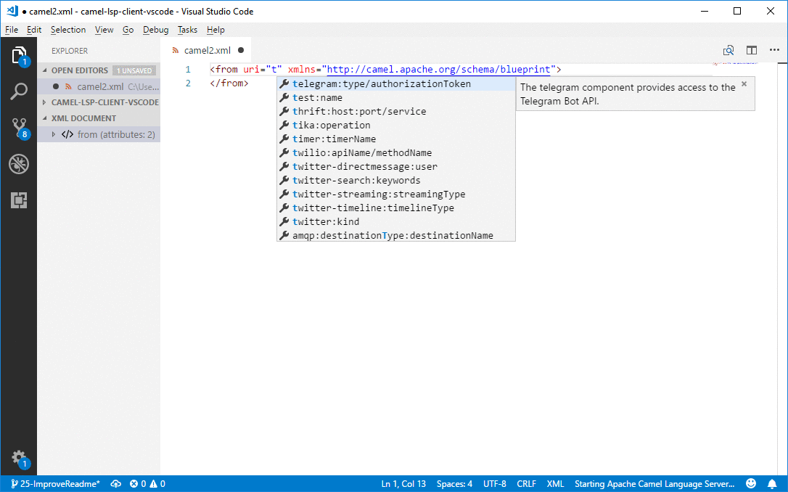

# Apache Camel for Visual Studio Code
This preview release of the extension adds language support for [Apache Camel](http://camel.apache.org/) to [Visual Studio Code](https://code.visualstudio.com/) including:
* Language service for Apache Camel URI with XML DSL:
  * Auto-Completion
  * Quick Info (Hover)

You can find more detailed information about Apache Camel supported features at Language Server [GitHub page](https://github.com/camel-tooling/camel-language-server#features).

## Contact Us
If you run into any issues or have suggestions, please file [issues and suggestions on GitHub](https://github.com/camel-tooling/camel-lsp-client-vscode/issues).

## How to install manually
* Install VS Code
* Go to latest release page https://github.com/camel-tooling/camel-lsp-client-vscode/releases/latest/
* Download the vscode-apache-camel-X.Y.Z.vsix file
* [Install from *.vsix](https://code.visualstudio.com/docs/editor/extension-gallery#_install-from-a-vsix)
  * Open Extensions View (Ctrl+Shift+X)
  * Click on the three dots at the top right of the view and then "Install from VSIX..."
  * Select the file and click Install
* Enjoy!
